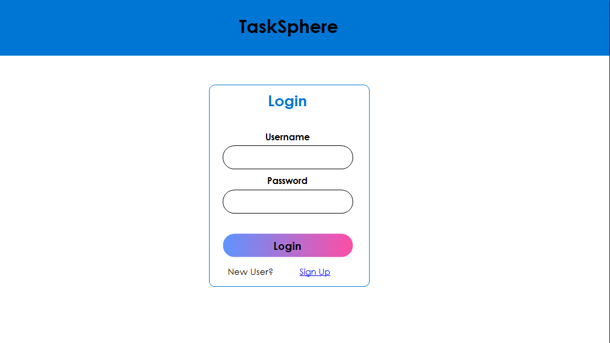
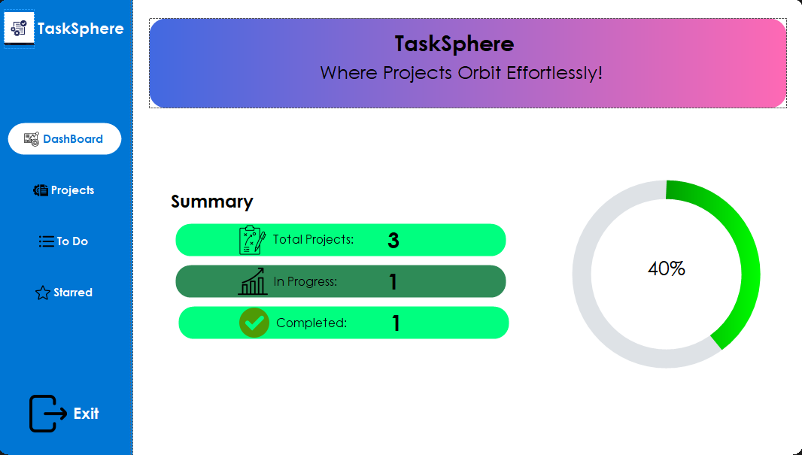
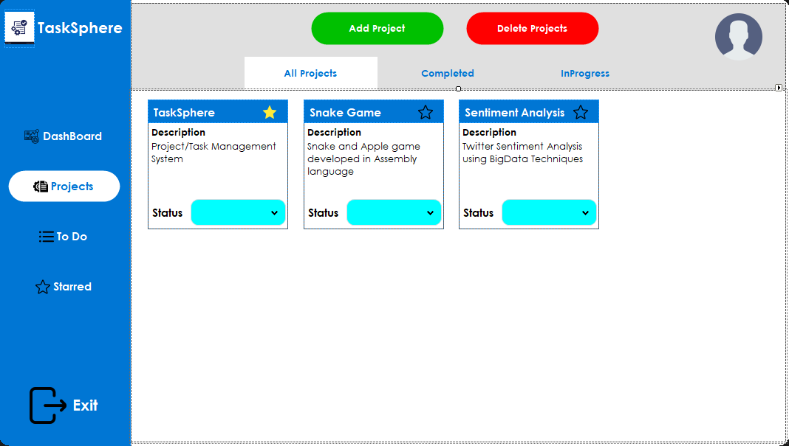
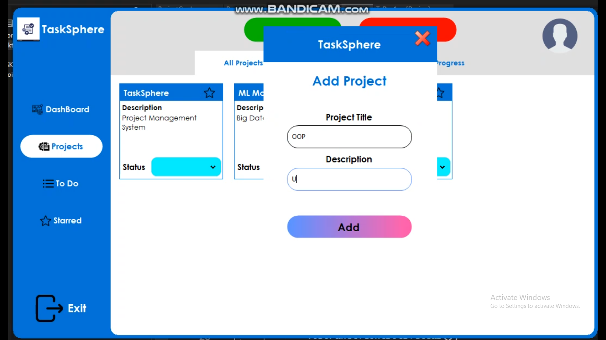

# Task Management System 

## Introduction

TaskSphere is an application designed to help you efficiently manage your tasks and to-do lists. Built with C# and the .NET framework, this system offers a user-friendly GUI and robust database connectivity. With TaskSphere, you can create tasks, organize them into to-do lists, set statuses, mark important tasks, and delete tasks. The comprehensive dashboard provides an overview of all your tasks.

## Graphical User Interface 

<div align="center">
  
  
  
  
  
</div>


## Technologies Used

- C#
- .NET Framework
- Windows Forms
- SQL Server (or any other database used)
- GUNA.UI2 package

## Features

- Create tasks and to-do lists
- Set task statuses (Pending/Completed)
- Mark tasks as important
- Delete tasks
- Dashboard for task overview

## Getting Started

### Prerequisites

- Windows OS
- Visual Studio
- SQL Server (or the database system you are using)

### Installation

1. **Clone the repository:**
    ```bash
    git clone https://github.com/burhanahmed1/Task-Management-System.git
    ```

2. **Open the solution file:**
    - Open `TaskSphere.sln` in Visual Studio.

3. **Set up the database:**
    - Restore the database backup provided in the `Database` folder.
    - Update the connection string in the `App.config` file to match your database settings.

4. **Build and run the application:**
    - Build the solution in Visual Studio.
    - Run the application.

### Usage

1. **Login/SignUp**
    - For a new user SignUp is compulsory, after SignUp user's data will be stored in the database and for his next visits he/she just Login to enter the app.

2. **Creating Tasks:**
    - Open the application and navigate to the task creation section.
    - Enter task details and save.

3. **Managing To-Do Lists:**
    - Create new lists, add tasks to them, and organize as needed.

4. **Setting Task Status:**
    - Update the status of tasks to 'Pending' or 'Completed' from the task details view.

5. **Marking Important Tasks:**
    - Star tasks to mark them as important for quick access.

6. **Deleting Tasks:**
    - Remove tasks from your list by selecting the delete option.

7. **Dashboard Overview:**
    - Use the dashboard to get a quick overview of all tasks, their statuses, and important tasks.
  
8. **Exit/Close App:**
    - Click on the Exit icon in the bottom of the main left panel.

## Contributing

Contributions are welcome! Please fork the repository and create a pull request with your changes.

## License

This project is licensed under the MIT License.

## Acknowledgements

Inspiration for this project came from the need for efficient task management tools.
